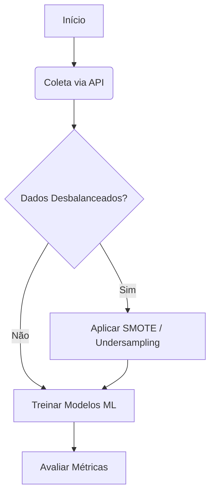

# Desafio final DIO-Bradesco

```mermaid
graph TD
    A[Início] --> B(Coleta via API)
    B --> C{Dados Desbalanceados?}
    C -- Sim --> D[Aplicar SMOTE / Undersampling]
    C -- Não --> E[Treinar Modelos ML]
    D --> E
    E --> F[Avaliar Métricas]
```
